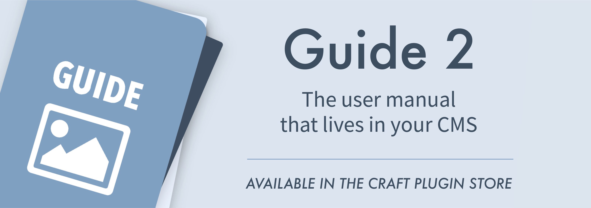
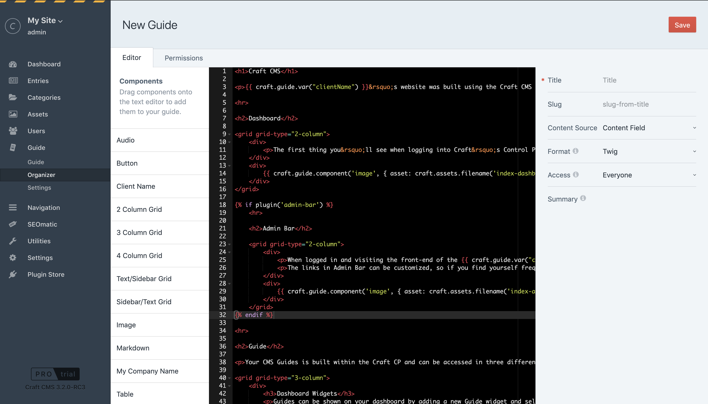
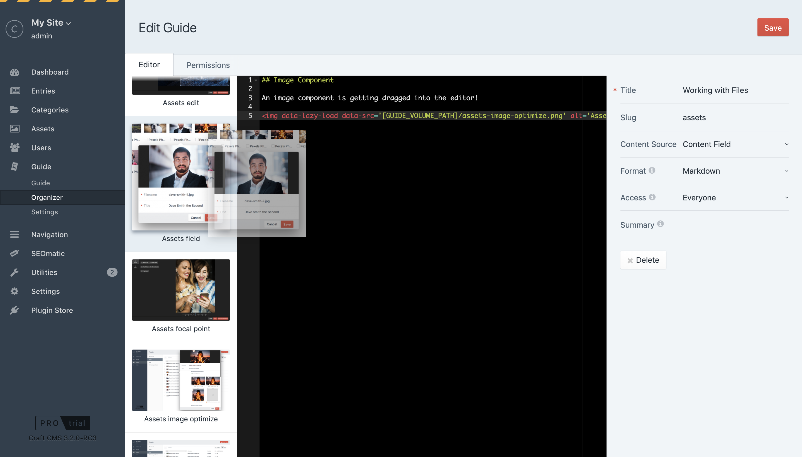
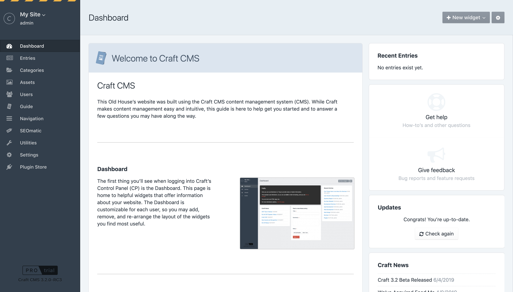
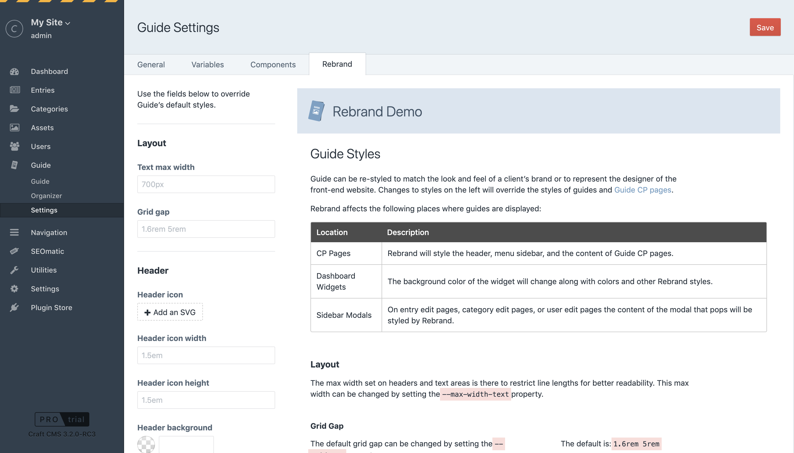

# Guide 2 for Craft CMS 3

A CMS Guide for Craft CMS.

Guide is made up of two parts:
- [The commercial plugin for Craft 3](https://plugins.craftcms.com/guide)
- [The open source user guide template](https://github.com/wbrowar/craft-guide-templates)

*Note: The license fee for the PRO edition this plugin is $49.00 via the [Craft Plugin Store](https://plugins.craftcms.com/guide). A LITE edition is offered for free.*


## Requirements

- This plugin requires Craft CMS 3.2 or later.
- A browser that support CSS Grid Layout and CSS Custom Properties.

## Installation

To install the plugin, you can find it in the [Craft Plugin Store](https://plugins.craftcms.com/guide), or follow these instructions.

1. Open your terminal and go to your Craft project:

        cd /path/to/project

2. Then tell Composer to load the plugin:

        composer require wbrowar/guide

3. In the Control Panel, go to Settings → Plugins and click the “Install” button for Guide.

## Setup

1. Visit the Guide settings page to configure a couple of setup options. The new `Template Path` and `Asset Path` settings are required for guides to be displayed.
2. Create your CMS guide using the built-in editor, by importing guides from [Craft Guide Templates](https://github.com/wbrowar/craft-guide-templates), or by selecting templates added to your Guide Template Path.
3. Use the Organizer to place your guides in the Guide CP section, on content edit pages, and on dashboard widgets.
4. Use Guide’s Rebrand settings page to style the look and feel of guides throughout the CMS.

---

## Guide Overview

Craft CMS is intuitive. Marketing plans and organizational workflows—not so much. Guide lets you create a user manual within Craft CMS so clients don‘t need to go far to get the answers they need.

## Guide Editor

A guide can be written by hand, imported as a template, or embedded as an iframe. All guides are created and configured in the Guide editor.



To create a new guide, go to the Organizer tab in the Guide CP section and click on the `+ New Guide` button.

When setting up a guide, you’ll set the following options:

| Options | Description |
| --- | --- |
| Title | The title of the guide as it appears throughout the CMS. |
| Slug | The slug of the guide used in its URI. The slug can be manually set or it can be automatically set based on the Title. |
| Content Source | Determine if the guide’s content should come from the editor field, a template, or an external URL. Changing this changes the fields in the Editor tab. |
| Format | For guides created using the editor field, changing the Format determines what language is used to render the guide content later. |
| Access | Determines who may access a guide. Setting this to "Restrict to permissions" requires permissions to be set in the Permissions tab. Setting this to "Everyone" or "Admins only" ignores the permissions set in the permissions tab. |
| Summary | A short summary of the guide displayed on the guide in the Organizer. |

### Components



When using the editor field to create a guide, you’ll see a column of components to the left. Each component can be dragged from the list onto the editor field and the component will be added at the place where the cursor is set.

Components are made up of either plain HTML, Markdown, Twig, or Vue components. HTML and Markdown-based components are meant to be simpler components where only content needs to be changed. Styles may change over time, but the markup will remain the same.

Twig and Vue components are meant to make it easy to create more complicated components that can be optimized and added to in the future.

### Twig Components

For example, the Markdown image component needs a URL and alt attribute to be set, and the markup for this component is a simple HTML `img` tag. You may manually change it as needed.

The Twig image component is based on a Guide variable and it looks like this: `{{ craft.guide.component('image', { url: 'REPLACE_URL' }) }}`

The first thing passed into the `component` variable is the handle for the component. In this case, it’s `image`. The second argument is an object of configuration options. This is an example of an image component that pulls an image file in from an external URL, so the `url` attribute is used to set the image source.

Under the hood, the Twig component is transforming the image to optimize its filesize at both 1x and 2x resolutions and lazy loading is added so the image doesn’t load until the reader scrolls down to it.

The above example is based on the "Image" Twig component, however, when you drag an asset component into the editor field you'll notice that the same `image` handle is used but different attributes are passed in:

```twig
{{ craft.guide.component('image', { asset: craft.assets.filename('assets-image-optimize.png').one() }) }}
```

A full list of available arguments will be added to this README in a future update.

### Twig Variables

When a guide is written in Twig format, Guide provides a set of Twig variables:

| Variable Example | Description |
| --- | --- |
| `{{ craft.guide.component('audio', { url: 'my-song.mp3' }) }}` | (Available in Guide PRO) Renders a Guide Component based on the handle set in the first argument and a configuration object in the second argument. |
| `{{ craft.guide.getAll({ format: 'twig' }) }}` | Performs a search of all guides that fit the criteria passed in. This will return an array of guide objects. |
| `{{ craft.guide.getAllForUser({ format: 'twig' }) }}` | Performs the same search as `craft.guide.getAll`, but returns only guides that the currently logged in user has permission to view. |
| `{{ craft.guide.getOne({ id: 10 }) }}` | Returns a single guide object based on the criteria passed in. |
| `{{ craft.guide.include({ slug: 'assets' }) }}` | Finds a matching guide and renders its content in place. |
| `{{ craft.guide.var('clientName') }}` | Returns variables set in Guide Settings. |

### Guide Templates

You may use templates to create your CMS guide in a way that's easily portable from one Craft site to another. To add a template to your CMS guide, follow these instructions:

1. Create your guide template and save it using `.md`, `.twig`, or `.html` as its file extension.
1. Place your file into the directory set as the Template Path setting in the Guide setting page. The default is set to `_guide`, so in that case your file would need to go into `./templates/_guide/`.
1. Go to the Organizer tab in the Guide CP section and click on the `+ New Guide` button to create a new guide.
1. Set Content Source to `Page Template`.
1. Select your new template in the Template field in the Editor tab.
1. Click the `Save` button.
1. Use the Organizer to drag your new guide to the desired location.

Guides in your Template Path can be included and imported by using the path `guide_template_path` in your Twig tags.

For example, a Twig file at the location `./templates/_guide/header.twig` would be can be included using: ``.

This will allow you to move the Template Path to a different location without breaking your includes and imports.

#### Markdown Templates

Templates saved as `.md` files will be parsed as [Github Flavored Markdown](https://guides.github.com/features/mastering-markdown/). 

### External Documentation

Selecting `External Page` from the Content Source guide option will let you display an external page in an iframe.


The iframe replaces the guide content and all styling is ignored.

---

## Guide Organizer


When a guide is first created, it will appear in the "Unused Guides" section of the Organizer. To the right of that column you’ll see columns for the Guide CP, Edit Pages and the Dashboard. Use drag and drop to move a guide to one of these locations.

When hovering over a guide in the Organizer, you'll see a gear appear to the right. Click on that to access quick actions for the guide:

| Action | Description |
| --- | --- |
| View | Preview the guide on a guide page as it would appear in the Guide CP. |
| Edit | Edit brings you to the guide edit page for that guide. Clicking save will return you back to the Organizer |
| Delete | Brings you to a delete confirmation page. Clicking the `Delete` button on this page will completely remove the guide from the CMS. |

### Guide CP Section


Guides dragged into the Guide CP area of the Organizer will appear in the Guide CP Section’s Guide tab. When a user clicks on the Guide CP section, it will bring them to the first guide in the list. The order of the guides in the Organizer determines the order of the guides in the sidebar navigation.

When viewing a guide in the CP section, all of the header tags (`h1, h2, h3, etc...`) will be used to generate a subnav in the sidebar of the page. Clicking on a subnav item will scroll the guide content down to that header.

### Content Edit Pages


Different guides can be displayed on any of the site’s entry sections or category groups. Using the Organizer to drag a guide onto a section area will add a guide menu to the sidebar on that section’s entry edit pages.

When a user is editing an entry in that section, they can click on a guide in the menu to pop up the guide in a modal. This allows the user to view the guide without leaving the edit page.

*NOTE: More than one guide can be added to each edit page.*

### Dashboard Widgets



Dragging a guide to the Dashboard area of the Organizer allows that guide to be added to a Guide widget. From there, a user can add a Guide widget to their dashboard and select this guide from the list of all guides in the Dashboard area.

---

## Styling Guides



Guide content is styled using many of Craft CP’s default CSS, but many of the colors and elements unique to Guide can be overridden using the Rebrand section of the Guide settings page. Here you’ll find fields that let you override specific colors and layout styles.

These fields are converted to [CSS custom properties](https://developer.mozilla.org/en-US/docs/Web/CSS/--*) and are loaded on all pages of the Craft CP.

The Rebrand section includes a text area that can be used to add your own custom CSS. To make sure the CSS doesn’t affect other parts of the CMS, be sure to start all selectors with `.guide_content`.

```css
/* Override Guide CSS with specific selectors */
.guide_content h1 {
  font-weight: 300;
}
```

All CSS custom properties generated by the fields in the Rebrand section are applied to a `.guide_styles` selector. So if you need to manually set a property, your custom css might look something like this:

```css
/* Override CSS Custom Properties */
.guide_styles {
  --grid-gap: 30px;
}
```

---

## Recipes, Tips, and Tricks

Here are some ideas that can help you write your Guide user manual.

### Guide Partials

The `craft.guide.include()` variable makes it easy to reuse guide content in several different places. For example, if you wanted to create a guide that talks about how to edit and publish entry content, you may consider this pattern:

1. Create a guide partial with your desired content.
1. In the Guide Organizer, leave this in the "Unused Guides" area. Even in the "Unused Guides" area, each guide is given a slug. In this example, let’s pretend the slug is `publishing-content`.
1. For each of your entry types, create a new guide with the Twig format, paste this into it: `{{ craft.guide.include({ slug: 'publishing-content' }) }}`, then use the Guide Organizer to add the guide to its respective content type.

Now when an author goes to edit an entry, they will have the option to view the content of the `publishing-content` guide from the list of guides in the edit page’s sidebar. What’s even better is that when the content of the `publishing-content` guide gets updated, it will get propagated to all of the places where the guide is included.

### To-Do List

Create a list of entries that need to updated by content authors:

```twig
{# Gather all of the entries that need to be updated by modifying this query #}


{# Display a list of the selected entries and provide the URL to their edit pages #}

<table>
  <thead>
    <tr>
      <th>Entry</th>
      <th>Edit URL</th>
    </tr>
  </thead>
  <tbody>
    
      <tr>
        <td>{{ entry.title }}</td>
        <td>{{ craft.guide.component('button', { label: 'Edit', url: entry.cpEditUrl }) }}</td>
      </tr>
    
  </tbody>
</table>

<p>There’s nothing to update!</p>

```

This might be added to a guide in a spot that explains the publishing rules for this type of entry or maybe as the content of a Guide Dashboard widget.

To-do lists can also be handy for one-time migrations or to keep an eye on entries that lose required assets or relations as things get moved around or deleted.

---

## Upgrading from Guide 1

When upgrading from Guide 1 to Guide 2 a migration will attempt to convert your old guides to Guide 2’s new format. All of your converted guides will be moved to the Organizer so they can be dragged to their desired location in the CP.

Templates built for Guide 1 will mostly be compatible, however, Guide 2 introduces some breaking changes. Here are some things that need to be updated to convert a Guide 1 template for Guide 2:

| Guide 1 | Guide 2 | Notes |
| --- | --- | --- |
| `updateGuideCpNav()` | No replacement | Use the Organizer to manage Guide CP Navigation |
| `{{ guideAsset('FILENAME') }}` | `{{ craft.guide.component('image', { asset: craft.assets.filename('FILENAME').one() }) }}` |  |
| `{{ guideQuery(OBJECT) }}` | `{{ craft.guide.getAll(OBJECT) }}` | `getAll` gets all guides for the given object. `{{ craft.guide.getAllForUser(OBJECT) }}` can be used to get guides that can be viewed by the logged in user. `{{ craft.guide.getOne(OBJECT) }}` is the same as `getAll` but `getAll` returns an array of guide objects, where `getOne` returns one guide object. |
| `{{ guideVar('VAR_KEY') }}` | `{{ craft.guide.var('VAR_KEY') }}` |  |
| `` | No replacement | Use Craft’s built-in `plugin()` Twig function: `` |

---

## Lite Edition

The PRO edition of Guide allows developers and clients to collaborate by creating guides within the CMS and by placing them throughout the CP.

The LITE edition is offered for developers who prefer to write their own guide templates and to display them in the Guide CP section.

Guide’s edition can be upgraded to PRO at any time.

---

## Guide Roadmap

Some things to do, and ideas for potential features:

- [ ] Convert guides from a template into the editor field so they can be updated within the CMS
- [ ] Export guide templates from guides created in the editor field
- [ ] Explore more guide components ([please send your suggestions here](https://github.com/wbrowar/craft-guide/issues))

Brought to you by [Will Browar](https://twitter.com/wbrowar)